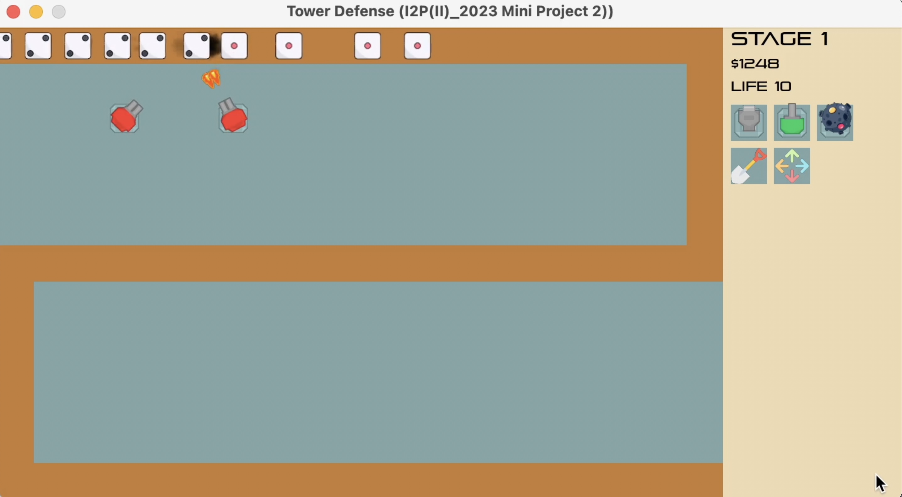

# NTHU-I2P-MiniProject2-2
NTHU CS. 11120 CS135601 Introduction to Programming (II) TA. Mini Project2.

Classic Tower Defense game.

## Description
- This repository is for the Introduction to Programming (II) course mini project2.
- The goal is to help students understand the OOP concept and get familiar with developing a project.

## Installation
Follow the step [here](https://github.com/j3soon/Allegro5Template/blob/master/docs/README.md).

## Branches
- hackathon: Hackathon for students. There's some bugs and incomplete parts of the game.
- hackathonTA: Finishing version of hackathon.
- main & miniProject2: Add some new features (Defenses & Armies) based on the hackathon.

## Demo
There are some detailed demo videos in the demos/ folder for the todos.

[Hackathon demo](demos/Hackathon-demo.mp4)
